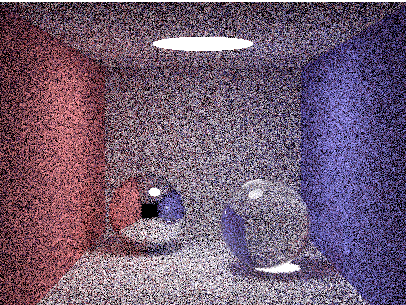

# clojure-smallpt

A Clojure implementation of 'smallpt' (small path tracing) that is originally coded with C.

## Usage

```shell
$ lein run [width] [height] [samples]
```

## Result



(800 x 600 pixels, 512 samples per pixel, computation took 38000 secs with 1.8 GHz CPU)

## License

Copyright (c) 2015 tatsy, Tatsuya Yatagawa

Distributed under the Eclipse Public License either version 1.0 or any later version.
